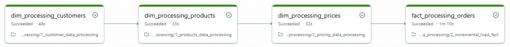

# AtliQon-Sportsbar-Consolidated-Pipeline

## Project Architecture


## Pipeline for the Job Run


### Repository Structure
```text
├── 1_setup
│   ├── dim_date_table_creation
│   ├── setup_catalogs
│   └── utilities
├── 2_dimension_data_processing
│   ├── 1_customer_data_processing
│   ├── 1_pricing_data_processing
│   └── 1_products_data_processing
├── 3_fact_data_processing
│   ├── 1_full_load
│   └── 2_incremental_load_fact
├── images
│   ├── job_run.png
│   └── project_architecture.png
├── sql_query
├── README.md
```


